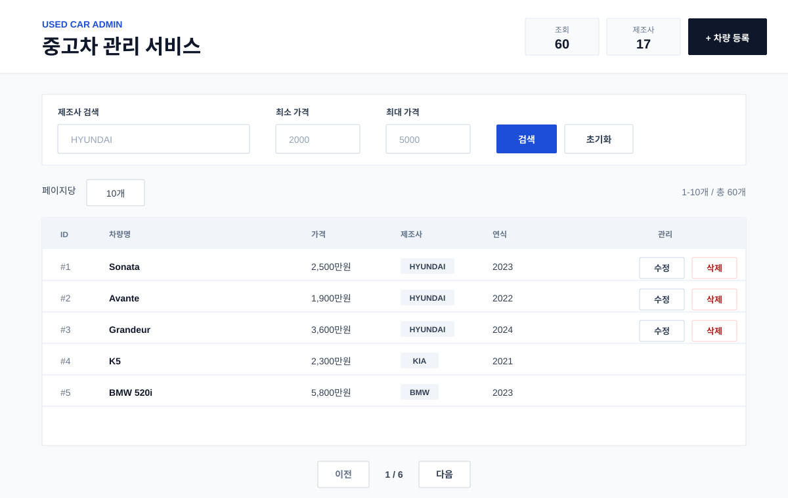
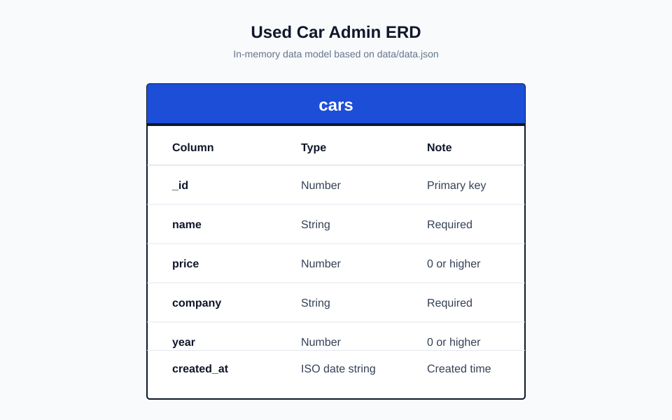

# 중고차 관리 서비스

## 1. 프로젝트 소개

중고차 정보를 등록, 조회, 수정, 삭제할 수 있는 웹 서비스입니다. 관리자는 차량 정보를 등록하고, 사용자는 제조사와 가격 조건에 맞는 차량을 검색할 수 있습니다. 현재는 프로토타입이므로 관리자가 로그인되어 있다는 전제로 동작합니다.

## 2. 주요 기능

- 차량 목록 조회
- 차량 상세 조회
- 차량 등록
- 차량 수정
- 차량 삭제
- 제조사별 검색
- 최소 가격, 최대 가격 필터

## 3. 사용 기술

- Frontend: Vite, React, Tailwind CSS
- Backend: Node.js, Express
- Data: 서버 메모리, `data/data.json`
- Deploy: Render

## 4. 실행 화면



## 5. 설치 및 실행 방법

루트 서버를 실행합니다.

```bash
npm install
npm start
```

프론트엔드 개발 서버를 실행합니다.

```bash
cd frontend
npm install
npm run dev
```

Render 배포용 빌드를 실행합니다.

```bash
npm run build
npm start
```

## 6. 배포 주소

- Render 배포 후 주소를 여기에 기록합니다.
- 예시: `https://your-service-name.onrender.com`

## 7. 폴더 구조

```text
codex-lab
├── README.md
├── server.js
├── package.json
├── data
│   └── data.json
├── assets
│   ├── erd
│   │   └── car-erd.svg
│   └── screenshots
│       └── car-list.svg
├── frontend
│   ├── src
│   │   ├── components
│   │   ├── pages
│   │   ├── App.jsx
│   │   └── main.jsx
│   └── vite.config.js
└── prompt
    ├── API_spec.md
    ├── init_prompt.md
    └── troubleShooting.md
```

## 8. API 요약

| 기능 | Method | URL |
|---|---|---|
| 상태 확인 | GET | `/api/health` |
| 차량 목록 조회 | GET | `/api/cars` |
| 차량 상세 조회 | GET | `/api/cars/:id` |
| 차량 등록 | POST | `/api/cars` |
| 차량 수정 | PUT | `/api/cars/:id` |
| 차량 삭제 | DELETE | `/api/cars/:id` |
| 제조사 검색 | GET | `/api/cars/search?company=HYUNDAI` |
| 가격 필터 | GET | `/api/cars/filter?minPrice=2000&maxPrice=3000` |

전체 자동차 목록을 조회합니다.

```bash
curl http://localhost:3000/api/cars
```

회사 이름으로 자동차를 검색합니다.

```bash
curl "http://localhost:3000/api/cars/search?company=HYUNDAI"
```

가격 범위로 자동차를 필터링합니다.

```bash
curl "http://localhost:3000/api/cars/filter?minPrice=2000&maxPrice=3000"
```

최소 가격 또는 최대 가격만 사용해도 동작합니다.

```bash
curl "http://localhost:3000/api/cars/filter?minPrice=2500"
curl "http://localhost:3000/api/cars/filter?maxPrice=2500"
```

차량을 등록합니다.

```bash
curl -X POST http://localhost:3000/api/cars \
  -H "Content-Type: application/json" \
  -d '{"name":"IONIQ 5","price":4300,"company":"HYUNDAI","year":2024}'
```

자세한 API 명세는 [prompt/API_spec.md](prompt/API_spec.md)를 참고합니다.

## 9. AI 활용 방식

- 초기 요구사항을 `prompt/init_prompt.md`에 정리했다.
- Codex를 사용해 Express API, React UI, Tailwind CSS 화면, 문서를 생성했다.
- 생성 후 `node --check`, 프론트 빌드, API 호출로 기본 동작을 확인한다.

## 10. 문제 해결 기록

트러블슈팅 기록은 [prompt/troubleShooting.md](prompt/troubleShooting.md)에 정리했습니다.

## 11. 개선 예정 사항

- 로그인 기능 추가
- 실제 DB 연동
- 페이지네이션 추가
- 등록/수정 입력값 검증 강화
- 테스트 코드 추가

## ERD


